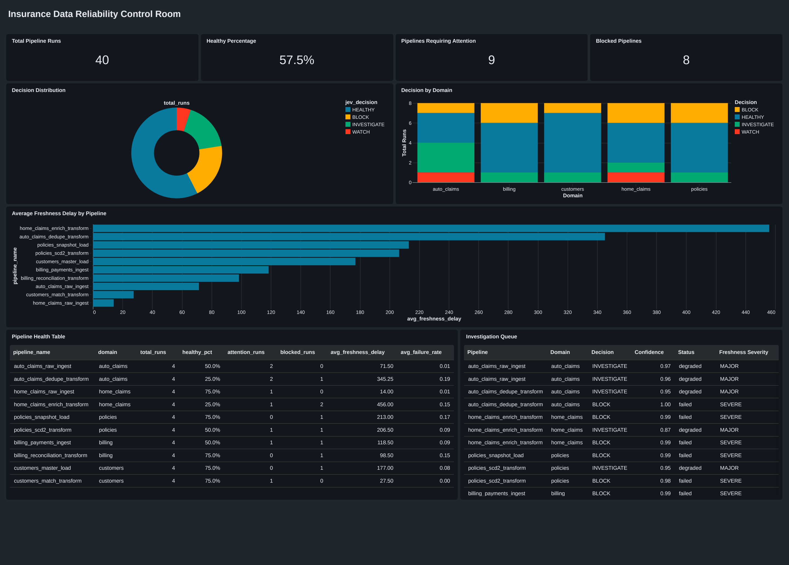

# Insurance Data Reliability Control Room


A reproducible control-room prototype for batch data pipelines. Python computes deterministic metrics over 40 synthetic insurance runs; [`typesafe-ai/jev`](https://github.com/typesafe-ai/jev) (via the Vercel AI SDK) assigns one bounded operational label per run; a validated one-to-one join produces the final analytics table. Everything runs offline against a checked-in sample — no API key required.

---

## What this is

- **A pattern**, not a product. The portable idea: separate *measurement* (deterministic, testable without a key) from *judgment* (bounded, auditable beside the metrics), then enforce the contract with a strict join.
- **A concrete instance** of that pattern over 40 synthetic insurance pipeline runs (5 domains, 2 days, seed 42), with a Databricks AI/BI dashboard and a Next.js static mirror.
- **A reference architecture** for anyone building decision layers over data-quality metrics — see `docs/ADR/001-jev-separation.md` and the rendered diagrams under `docs/architecture/`.

---

## Table of contents

- [The pattern (portable)](#the-pattern-portable)
- [Features](#features)
- [Architecture](#architecture)
- [Dashboard preview](#dashboard-preview)
- [Quickstart](#quickstart)
- [Data and results](#data-and-results)
- [Quality gates](#quality-gates)
- [Repository layout](#repository-layout)
- [Documentation](#documentation)
- [Scope & what's not included](#scope--whats-not-included)
- [Contributing](#contributing)
- [Security](#security)
- [Acknowledgments](#acknowledgments)
- [License](#license)

---

## The pattern (portable)

Pipeline reliability needs two distinct things: numeric facts (failure rate, variance, freshness) and an operational call (`HEALTHY` / `WATCH` / `INVESTIGATE` / `BLOCK`). Mixing them makes results untestable and model-dependent. This project separates them into three layers with a strict contract:

1. **Measurement** — pure Python in `src/metrics.py`. Deterministic, no I/O, no model call. Spark UDFs call into it; the Databricks notebook mirrors it. Reproducible byte-for-byte from the same input.
2. **Judgment** — `jev/evaluate.mjs`, an isolated Node module that reads measured state and asks Jev one bounded choice question per run. Jev returns one label from a fixed set; the native probability it returns is recorded as `jev_confidence` (nullable).
3. **Validated join** — `src/build_final.py` enforces one-to-one coverage on `run_id` and refuses to write output unless every source run has exactly one allowed label.

The practical consequences: metrics are testable without any API key; decisions are auditable beside the metrics; a missing or invalid decision fails closed (no partial output, no dead-letter); and swapping the decision model, the metrics, or the storage target does not require rewriting the other layers. The full rationale lives in [`docs/ADR/001-jev-separation.md`](docs/ADR/001-jev-separation.md).

---

## Features

- **Deterministic synthetic generator** — 40 runs (seed 42), 8 each across `auto_claims`, `home_claims`, `policies`, `billing`, `customers`.
- **Single-source-of-truth metrics** — `failure_rate`, `row_count_variance`, `duration_variance`, `freshness_severity`, `schema_drift_present`, `error_present`. Computed in plain Python; Spark UDFs add no logic.
- **Bounded Jev decision layer** — `typesafe-ai/jev` via the Vercel AI SDK. Four allowed labels with native confidence; non-idempotent by design.
- **Validated one-to-one final join** — fails closed on missing, duplicate, or out-of-vocabulary decisions.
- **Delta + portable CSV outputs** — `data/delta/pipeline_metrics` and `data/delta/pipeline_analytics` for Unity Catalog, `data/final_analytics.csv` for portable mirroring.
- **Databricks AI/BI dashboard** — verified end-to-end. Spec in `docs/dashboard-spec.md`, screenshot in `docs/screenshots/`.
- **Next.js static mirror** — `web/` consumes `final_analytics.csv` via `scripts/sync_web_data.py`; no live backend required.
- **Reproducible offline path** — checked-in `data/jev_decisions.json` means full reproduction without an API key.

---

## Architecture

```text
data/pipeline_runs.csv (seed 42, 40 runs)
  -> src/spark_pipeline.py (UDFs -> src/metrics.py; no new logic)
    -> data/delta/pipeline_metrics (Delta)
    -> data/jev_input.json        (measured, unlabeled)
  -> jev/evaluate.mjs             (typesafe-ai/jev via Vercel AI SDK)
    -> data/jev_decisions.json    (one label + native confidence per run)
  -> src/build_final.py           (coverage + label validation, join on run_id)
    -> data/delta/pipeline_analytics (Delta)
    -> data/final_analytics.csv       (portable CSV export)
  -> notebooks/databricks_pipeline.py  -> Databricks AI/BI dashboard
  -> scripts/sync_web_data.py          -> web/src/data/runs.json
  -> web/                              -> Next.js static mirror
```

A rendered version of this flow lives at [`docs/architecture/system-architecture.svg`](docs/architecture/system-architecture.svg) (plus an interactive HTML viewer at the same path with `.html`). The data-only flow (metrics in, decisions out) is at [`docs/architecture/jev-data-flow.svg`](docs/architecture/jev-data-flow.svg). Full architectural notes and key decisions are in [`docs/ARCHITECTURE.md`](docs/ARCHITECTURE.md).

---

## Dashboard preview



The Databricks AI/BI dashboard reads the validated `pipeline_analytics` Delta table. It keeps measured facts beside the Jev decision so a reviewer can inspect pipeline health, find severe runs, and compare each decision with its deterministic signals. The PNG shown above is at [`docs/screenshots/databricks-dashboard.png`](docs/screenshots/databricks-dashboard.png); a PDF copy is at [`docs/screenshots/databricks-dashboard.pdf`](docs/screenshots/databricks-dashboard.pdf). The Next.js static mirror in `web/` renders the same data without any live backend.

---

## Quickstart

### Prerequisites

- **Python 3.12** — required for the metrics layer and tests.
- **Java 17** — required even on the offline path; the local Spark pipeline runs `local[1]`.
- **Node.js 22** — required only for the Jev decision step and the `web/` Next.js build.

```bash
# macOS (Homebrew)
brew install openjdk@17
export JAVA_HOME=/opt/homebrew/opt/openjdk@17
# Linux: export JAVA_HOME=/usr/lib/jvm/java-17-openjdk-amd64
```

### Run it (offline, no API key)

```bash
git clone https://github.com/sathwikio/insurance-data-reliability-control-room.git
cd insurance-data-reliability-control-room

make setup              # python venv, pip install -e ".[dev]", jev npm install
cp .env.example .env    # leave AI_GATEWAY_API_KEY empty for offline path

make e2e-no-key         # data -> metrics -> build_final -> pytest
make sync-web           # regenerate web/src/data/runs.json from final_analytics.csv
cd web && npm ci && npm run build
```

### Run it in Docker

```bash
docker build -t insurance-control-room:repro .
docker run --rm insurance-control-room:repro python -m pytest tests/ -q
```

### Manual fallback

If you'd rather not use `make`:

```bash
python -m venv .venv && source .venv/bin/activate
pip install -r requirements.txt && pip install -e ".[dev]"
(cd jev && npm install)
python -m src.generate_data
python -m src.spark_pipeline
python -m src.build_final
python -m pytest tests/ -q
python scripts/sync_web_data.py
(cd web && npm ci && npm run build)
```

### Fresh Jev run (requires `AI_GATEWAY_API_KEY`)

A fresh Jev evaluation is **not idempotent** — the checked-in decisions may not be reproduced exactly. Update [`docs/JEV_EVAL.md`](docs/JEV_EVAL.md) and `data/jev_run_meta.json` afterward.

```bash
cd jev && npm install
export AI_GATEWAY_API_KEY=...
npm run evaluate && cd ..
python -m src.build_final
```

---

## Data and results

The seed-42 synthetic dataset contains 40 runs: 8 each across `auto_claims`, `home_claims`, `policies`, `billing`, `customers`, scheduled across 2026-09-18 and 2026-09-19. The generator profile field `status` takes one of `healthy`, `degraded`, or `failed`; the Jev layer is expected to mirror that with the bounded label set.

Per-run signals (computed deterministically in `src/metrics.py`):

- `failure_rate` — `failed_rows / expected_rows`, 6dp
- `row_count_variance` — `(actual_rows - expected_rows) / expected_rows`, 6dp
- `duration_variance` — `(duration - expected_duration) / expected_duration`, 6dp
- `freshness_severity` — `ON_TIME` ≤15, `MINOR` ≤60, `MAJOR` ≤240, else `SEVERE`
- `schema_drift_present` — true for `column_added`, `type_changed`, or `column_removed`
- `error_present` — true when `error_message` is non-empty

Checked-in decision distribution (seed 42, 40/40 coverage): **23 HEALTHY, 2 WATCH, 7 INVESTIGATE, 8 BLOCK**. See [`docs/JEV_EVAL.md`](docs/JEV_EVAL.md) for the confusion table and provenance.

---

## Quality gates

### Tests — 56 cases across 7 files

| File | Cases | What it covers |
|---|---:|---|
| `tests/test_metrics.py` | 21 | `src/metrics.py` formulas, thresholds, edge cases, record shape |
| `tests/test_generation.py` | 10 | Fixed-seed generation: domain counts, status distribution, field schema |
| `tests/test_decisions.py` | 7 | Jev input fidelity, decision coverage, allowed labels, confidence bounds |
| `tests/test_final_logic.py` | 10 | Final-table consistency and offline join-rule validation |
| `tests/test_jev_quality.py` | 4 | Semantic invariants: `failed` → `BLOCK`, `healthy` → `HEALTHY`, etc. |
| `tests/test_notebook_parity.py` | 2 | Databricks notebook reproduces the metrics layer verbatim |
| `tests/test_web_sync.py` | 2 | `web/src/data/runs.json` stays in sync with `final_analytics.csv` |

### CI

GitHub Actions (`.github/workflows/ci.yml`) runs on every push and pull request:

- **Lint** — `ruff check src tests scripts`
- **Unit tests with coverage** — `pytest -k "not spark and not delta" --cov=src`
- **Checked-in artifact validation** — `pytest tests/test_decisions.py tests/test_generation.py tests/test_metrics.py`
- **Web** — `npm ci`, `tsc --noEmit`, `next build`

### Local equivalents

```bash
make test          # full pytest run
make test-cov      # with coverage report
make lint          # ruff check + format --check
```

---

## Repository layout

```text
src/                         deterministic metrics, Spark UDFs, generation, validated final join
  metrics.py                 single source of truth for metric formulas
  spark_pipeline.py          local Spark job; UDFs delegate to metrics.py
  build_final.py             coverage + label validation, one-to-one join on run_id
  generate_data.py           seed-42 synthetic run generator
jev/                         bounded choice decision layer (Node, Vercel AI SDK)
  evaluate.mjs               reads jev_input.json, writes jev_decisions.json + jev_run_meta.json
  package.json               ai@7.0.114, @ai-sdk/gateway@4.0.92
data/                        synthetic inputs, Jev I/O, final analytics (CSV + Delta)
tests/                       56 pytest cases across 7 files
notebooks/                   Databricks pipeline (verified) + Fabric pipeline (unverified)
web/                         Next.js static mirror of data/final_analytics.csv
scripts/sync_web_data.py     regenerates web/src/data/runs.json from final_analytics.csv
docs/                        architecture, data dictionary, ADR, dashboard spec, JEV eval, limits
  architecture/              rendered system + Jev data-flow SVGs (plus interactive HTML)
  screenshots/               Databricks AI/BI dashboard (PNG + PDF)
  ADR/                       architectural decision records
.github/workflows/ci.yml     Python + web CI
Makefile                     setup, test, lint, e2e-no-key, sync-web, web helpers
Dockerfile                   reproducible container for pytest
pyproject.toml               package metadata, ruff config, pytest config
.env.example                 JAVA_HOME hint + optional AI_GATEWAY_API_KEY
```

---

## Documentation

- [`docs/ARCHITECTURE.md`](docs/ARCHITECTURE.md) — system architecture, data flow, key decisions
- [`docs/architecture/system-architecture.svg`](docs/architecture/system-architecture.svg) — rendered system diagram (plus `.html` viewer)
- [`docs/architecture/jev-data-flow.svg`](docs/architecture/jev-data-flow.svg) — rendered metrics-in / decisions-out flow
- [`docs/DATA_DICTIONARY.md`](docs/DATA_DICTIONARY.md) — source, metric, and decision field definitions
- [`docs/ADR/001-jev-separation.md`](docs/ADR/001-jev-separation.md) — separation of measurement from judgment
- [`docs/dashboard-spec.md`](docs/dashboard-spec.md) — Databricks AI/BI dashboard specification
- [`docs/screenshots/databricks-dashboard.png`](docs/screenshots/databricks-dashboard.png) — verified dashboard screenshot
- [`docs/JEV_EVAL.md`](docs/JEV_EVAL.md) — Jev decision-quality invariants and provenance
- [`docs/LIMITS.md`](docs/LIMITS.md) — scope, performance characteristics, and what to swap in for production

---

## Scope & what's not included

This is a **prototype** — batch, 40 synthetic runs over two days. By design, it does not include:

- **Scheduling, streaming, or backfill.** No orchestrator, no queue, no watermark logic.
- **Live alerting.** Dashboards are read-only; there is no notification path.
- **Production-grade performance.** Local Spark uses `local[1]`, `shuffle.partitions=1`, and per-row Python UDFs — chosen for determinism, ~10–100x slower than native Spark functions.
- **Resilience plumbing.** The final join fails closed with no output and no quarantine or dead-letter table.
- **Verified Fabric deployment.** `notebooks/fabric_pipeline.py` is included as a future target but has not been run live.
- **Live insurer connection.** All data is synthetic. There is no network path to any real system.

For guidance on what to swap in for production use — native Spark functions, partition columns, incremental loads with watermarks, primary-key enforcement, quarantine tables, scheduled runs with alerting — see [`docs/LIMITS.md`](docs/LIMITS.md).

---

## Contributing

See [`CONTRIBUTING.md`](CONTRIBUTING.md). The project enforces one rule above all others: **measurement and judgment stay separate.** Python computes metrics, never assigns `HEALTHY`/`WATCH`/`INVESTIGATE`/`BLOCK`; Jev selects one label, never computes metrics. PRs that violate that separation will be rejected. The full PR checklist (tests, lint, web sync, docs, secrets) is in `CONTRIBUTING.md`.

---

## Security

See [`SECURITY.md`](SECURITY.md). All data in `data/` is synthetic. Never commit `AI_GATEWAY_API_KEY`, Databricks tokens, Unity Catalog paths to real data, or any other secret. The Jev step reads `AI_GATEWAY_API_KEY` from the process environment only. To report a vulnerability, open a GitHub private security advisory or contact the maintainer directly.

---

## Acknowledgments

- [`typesafe-ai/jev`](https://github.com/typesafe-ai/jev) — bounded-choice decision model
- [Vercel AI SDK](https://sdk.vercel.ai/) — model integration (`ai`, `@ai-sdk/gateway`)
- [Apache Spark](https://spark.apache.org/) and [Delta Lake](https://delta.io/) — local compute + table format
- [Next.js](https://nextjs.org/) — static dashboard mirror
- [Databricks AI/BI](https://www.databricks.com/product/bi) — verified dashboard target
- [pytest](https://docs.pytest.org/) and [ruff](https://docs.astral.sh/ruff/) — test and lint toolchain
- [Contributor Covenant 2.1](https://www.contributor-covenant.org/version/2/1/code_of_conduct/) — Code of Conduct

---

## License

[MIT](LICENSE) — Copyright (c) 2026 Sathwik Golamari.
