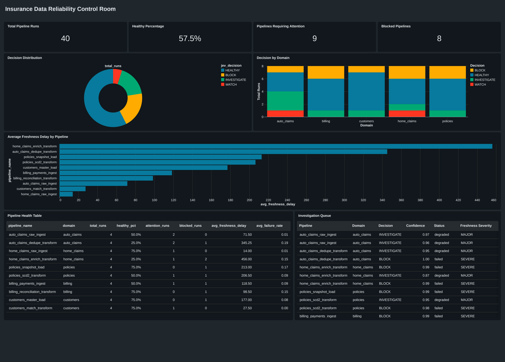

# Databricks AI/BI Dashboard Specification

This document defines the verified dashboard for the Insurance Data Reliability Control Room.

The dashboard reads the Delta table `pipeline_analytics`. The Databricks notebook creates that table and provides the source SQL queries.

## Purpose

The dashboard keeps measured facts beside the Jev decision.

A reviewer can inspect pipeline health, find severe runs, and compare each decision with its deterministic signals.

## Source table

The dashboard uses `pipeline_analytics`.

The table joins one deterministic metric row with one Jev decision row on `run_id`.

The join requires complete decision coverage and an allowed label for every run.

## KPI cards

| Card | Definition |
|---|---|
| Total pipeline runs | `COUNT(*)` |
| Healthy % | Share of rows with `jev_decision = 'HEALTHY'` |
| Requires attention | Rows with `jev_decision IN ('WATCH', 'INVESTIGATE')` |
| Blocked pipelines | Rows with `jev_decision = 'BLOCK'` |

## Visuals

| Visual | Type | Source fields |
|---|---|---|
| Decision distribution | Bar chart | `jev_decision`, run count |
| Domain distribution | Bar chart | `domain`, `jev_decision`, run count |
| Freshness delay trend | Line chart | `run_timestamp`, `freshness_delay_minutes` |
| Pipeline health | Table | Metric and decision fields |
| Investigation queue | Table | Severe-run fields and Jev confidence |

## Pipeline health table

Use these columns in this order:

```text
run_id
pipeline_name
domain
run_timestamp
status
jev_decision
jev_confidence
failure_rate
row_count_variance
duration_variance
freshness_delay_minutes
freshness_severity
schema_drift
```

Sort `run_timestamp` in descending order.

## Investigation queue

Show rows with `jev_decision` equal to `INVESTIGATE` or `BLOCK`.

Use these fields:

```text
run_id
pipeline_name
failure_rate
row_count_variance
freshness_severity
schema_drift
error_message
jev_decision
jev_confidence
```

Sort `jev_confidence` in ascending order.

## Filters

Add filters for these fields:

- `domain`
- `jev_decision`
- `schema_drift_present`

## Design rules

Keep deterministic metrics and Jev decisions visually distinct.

Do not add generated explanations, chat controls, or agent controls.

Use the final Delta table as the dashboard source.

Keep the dashboard read-only.

## Recreate the dashboard

1. Run `notebooks/databricks_pipeline.py`.
2. Verify that the notebook creates `pipeline_analytics`.
3. Open Databricks AI/BI Dashboards.
4. Create a dashboard from `pipeline_analytics`.
5. Add the four KPI cards.
6. Add the decision distribution bar chart.
7. Add the domain distribution bar chart.
8. Add the freshness delay line chart.
9. Add the pipeline health table.
10. Add the investigation queue.
11. Add the dashboard filters.
12. Publish the dashboard.

## Evidence

The repository contains a screenshot and PDF export from the verified Databricks dashboard.



[Open the PDF export](screenshots/databricks-dashboard.pdf)

## Microsoft Fabric

The Fabric notebook targets the same `pipeline_analytics` table shape.

A live Fabric dashboard test is not part of this project. The Databricks dashboard remains the verified presentation layer.
